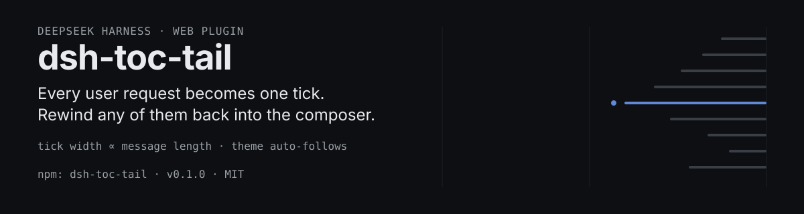
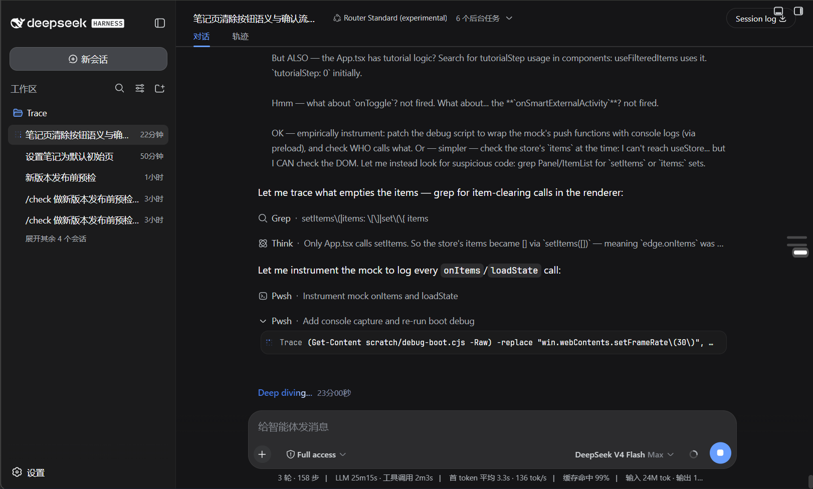
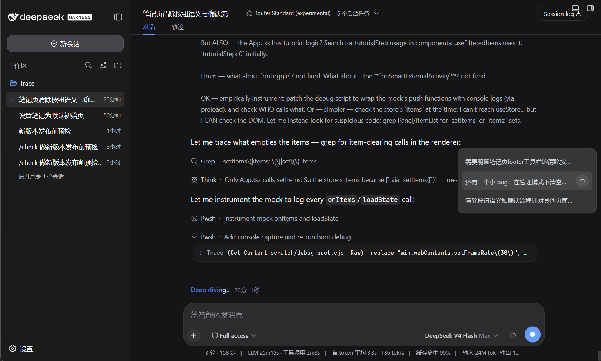
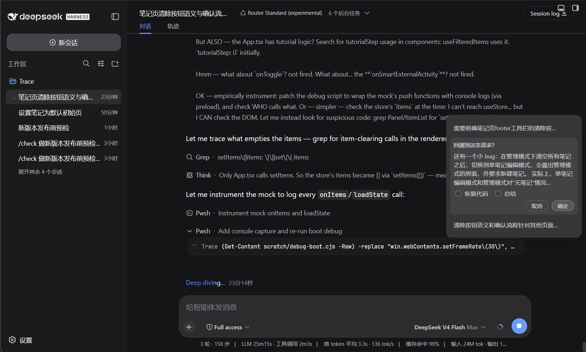

# dsh-toc-tail

A conversation outline rail with rewind for the DeepSeek Harness web interface. Every user request becomes one tick in a vertical timeline at the conversation column's right edge; the directory panel can rewind to any user request, withdrawing it back to the composer.

<p align="center">
  
</p>

## Screenshots

The rail: one tick per user request, width proportional to message length.

<p align="center">
  
</p>

Hover or focus a tick to open the directory panel listing every request with its summary.

<p align="center">
  
</p>

Each row carries a rewind button that opens the confirm menu: restore code and/or summarize, then confirm.

<p align="center">
  
</p>

## What it is

A lightweight conversation outline for long sessions. Each user request compresses into one horizontal tick; the tick width scales with the message length, and the longest request defines the scale. Hover or focus a tick to open a rounded directory panel with every request's summary and a rewind button.

## Why it works

- **Tick width ∝ message length**: the longest request gets the widest tick, every other tick scales by its length ratio, so the rail reads like a map of the conversation.
- **Paragraph-scoped highlighting**: the request whose paragraph is in the viewport stays highlighted; an assistant reply keeps its request's tick highlighted until the next request scrolls into view.
- **Theme auto-follow**: the rail, directory, and rewind cards ride the theme tokens projected by the Harness (`--dsw-*`), so light/dark switching recolors the whole plugin instantly.

## Rewind

Rewinding to a user request withdraws that message as if it was never sent: the message text is prefilled back into the composer, and the conversation is folded up to the previous request's assistant reply. Everything from the withdrawn message onward is collapsed.

- **No options selected** — folds to the selected position only.
- **Summarize** — the folded span is summarized by the model and the report replaces it as context.
- **Restore code** — the workspace files are restored to their snapshot at that request (snapshots are taken automatically before every user request).

The folded conversation disappears from the web view, and the fold marker card shows the summary (or a fold notice) with the number of collapsed messages.

## Install or Update

Install from npm:

```sh
dsh plugin --profile web add dsh-toc-tail
```

Or install from the GitHub release tarball:

```sh
dsh plugin --profile web add https://github.com/PaRr0tBoY/dsh-toc-tail/archive/refs/tags/v0.1.0.tar.gz
```

Use the same command to update an existing installation. Restart `dsh web` after installation so the Host and browser client load the new version.

## Behavior Notes

- The rail appears once the conversation has at least three user requests.
- The rail is vertically centered against the viewport and sits at the conversation column's right edge, keeping the screen's small edge gap.
- Rewound requests lose their ticks and their flow rows are hidden.
- Clicking a row's summary area jumps to that message; clicking the rewind button opens the confirm menu.

## Development

```sh
pnpm install
pnpm run verify
```

The development setup expects the Harness checkout available through the peer dependencies. Built files under `lib/` are committed so profile installation does not require package build scripts.

## License

MIT
